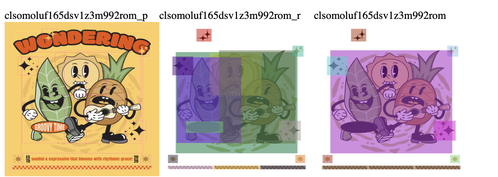
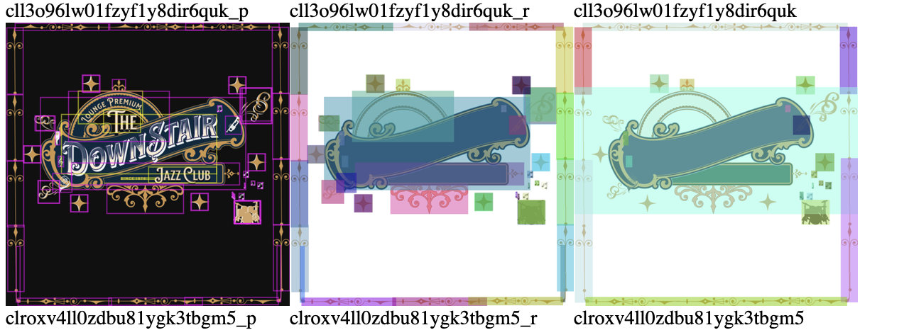
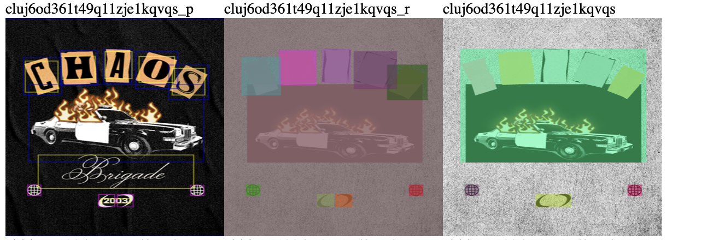
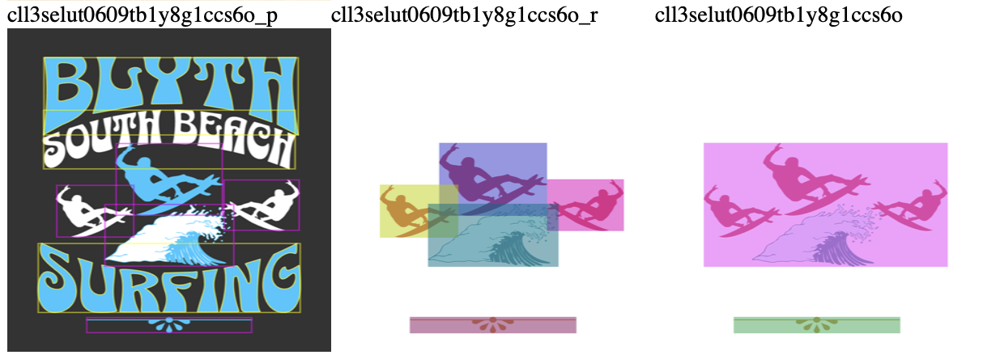
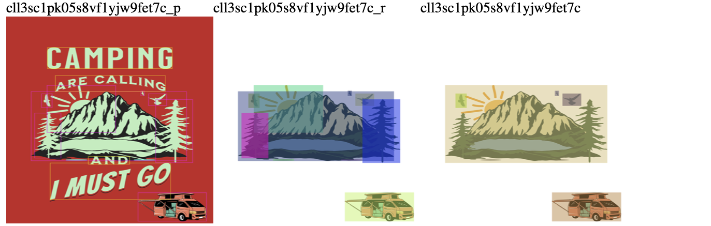

## Introduction

Implements a bounding box merging algorithm. The merging logic is inspired from [1].

We iterate through all the bounding boxes associated with a template and extend/enlarge them using two parameters
**delta_x** and **delta_y**. If two bounding boxes overlap after the extension then these are merged by considering their
**intersection over union (IoU)**.

In total, we need to set three parameters:

* delta_x : Determines % extension on the x-axis.
* delta_y : Determines % extension on the y-axis.
* iou_threshold : Determines the IoU threshold below which two bounding boxes are merged.

## Visualisations

Expected output with delta_x=0.4, delta_y=0, iou_threshold=0.1



<br/><br/>



<br/><br/>



<br/><br/>



<br/><br/>



<br/><br/>

## Installation

Create a new conda env with python 3.10

```
conda create -n "bbox-merge" python=3.10
conda activate bbox-merge
```

Install dependencies
``pip install -r requirements.txt``

## How to run

Download templates.json from https://drive.google.com/drive/folders/1hJPy_RekvsnpJF_ve_0wo1g7IkW8CZxm?usp=drive_link

#### Run using a specific template ID

```
python bbox_merge.py \
   --save_path ./path_to_save_result \
   --template_id cll3t1ah106p7wc1ysy30yvwd \
   --json_path ./path_to_templates.json \
   --delta_x 0.4 \
   --delta_y 0 \
   --iou_threshold 0.1 \
```

#### Run with randomly sampled templates

```
python bbox_merge.py \
   --save_path ./path_to_save_result \
   --num_templates 100 \
   --json_path ./path_to_templates.json \
   --delta_x 0.4 \
   --delta_y 0 \
   --iou_threshold 0.1
```

* save_path : Path where the image visualizations and the HTML report will be saved.
* num_templates : Number of templates to sample.
* json_path : Path to templates.json file.
* delta_x : Percentage of bbox extension on x-axis.
* delta_y : Percentage of bbox extension on y-axis.
* iou_threshold : IoU threshold for merging bounding boxes.

## Notes

We experimented with two alternative approaches which did not provide a good result ; for this reason these have not been included.
These appraoches are described here for future reference:

1. Compute a representative point for each bounding box (e.g. center) and apply an agglomerative clustering algorithm. The problem with this approach is that
   it does not consider the scale/size of the bounding boxes on canvas. This observation led us to experiment with the deployed expand-and-merge strategy.
2. Expand/enlarge bounding boxes and merge those that intersect. This also works but introdcuing the IoU threshold gives a lot more controllability.

## References

[1] https://www.semanticscholar.org/paper/ACF-Based-Region-Proposal-Extraction-for-YOLOv3-in-Liu-Guo/34a234ad72ca32acd672c6c838e347fc628bcdb4

## Contact

For any questions, please contact danaitri22@gmail.com
